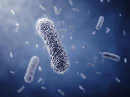

#Preamble
 
This markdown file contains part 2 of BIOL432 assignment 3 involving DNA sequence analysis.

```{r load data and packages}
library(dplyr)
library(knitr)
library(rentrez)
library(stringr)
library(ggplot2)

MyData<- read.csv("Sequences.csv")
print(MyData)
```

#Print Each Sequence

## HQ433692.1

```{r print HQ433692.1}
print(MyData$Sequence[1])
```

## HQ433694.1

```{r print HQ433694.1}
print(MyData$Sequence[2])
```

## HQ433691.1

```{r print HQ433691.1}
print(MyData$Sequence[3])
```

# Base Pair Count

```{r bp}
# count the number of each base pair in each sequence
## create col for each bp
MyData$num.a<- str_count(MyData$Sequence, "A")
MyData$num.t<- str_count(MyData$Sequence, "T")
MyData$num.g<- str_count(MyData$Sequence, "G")
MyData$num.c<- str_count(MyData$Sequence, "C")

# print out the num of nucleotides as a table
bptab<- kable(select(MyData, -Sequence))
print(bptab)
```

# GC Content

```{r gc cont}
# calculate GC content
for(i in 1:length(MyData$Sequence)){
    MyData$GC.cont[i]<- ((MyData$num.g[i]+MyData$num.c[i])/nchar(as.character(MyData$Sequence))[i]*100)
}
print(MyData$GC.cont)

# make a table of GC content
gctab<- kable(select(MyData, X, GC.cont))
print(gctab)
```

# Image and Link

Here is an image of bacteria 

Here is a link to the wikipedia page about [**Borrelia burgdorferi**](https://en.wikipedia.org/wiki/Borrelia_burgdorferi)

# GC Content Scatterplot

```{r gc cont2}
GC<- read.csv("GC_content.csv")
head(GC)

# add %GC col
GC<- mutate(GC, perc_GC = C + G)
head(GC)

qplot(x=Species, y=perc_GC, data=GC, 
      colour=Species,
      ylab="Percent GC Content") +
  theme_classic()
```

